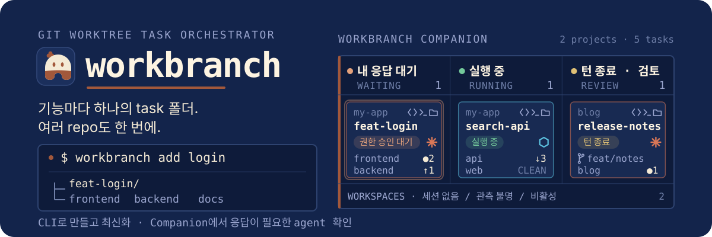

# workbranch

<p align="center">
  
</p>

**한국어** | [English](README.md)

[](https://github.com/tkhwang/workbranch/actions/workflows/ci.yml)
[](https://github.com/tkhwang/workbranch/releases)
[](LICENSE)


`git worktree` 명령을 매번 기억하지 않아도 task 단위 worktree를 관리할 수 있습니다.

`workbranch`는 feature마다 하나의 task 폴더를 만들고, single repo와 multi-repo 프로젝트 모두에서 짧고 안전한 branch refresh 명령을 제공합니다.

CLI는 workspace/project 상태를 읽고 task worktree와 Git 흐름을 실행합니다. Companion은 macOS menu bar에서 task별 AI agent 세션을 `내 응답 대기 | 실행 중 | 턴 종료 · 검토` 보드로 보여주므로, 어떤 agent가 내 응답을 기다리는지 바로 알 수 있습니다. 보드 위 usage 요약과 Usage view는 agent가 남긴 로컬 파일을 읽어 Claude Code·Codex의 token 사용량과 플랜 한도를 보여줍니다.


## 한눈에 보기

| 필요할 때                                      | 사용                 | 역할                         | 설치                                                   |
| ---------------------------------------------- | -------------------- | ---------------------------- | ------------------------------------------------------ |
| task workspace 생성, 최신화, land/push         | `workbranch` CLI     | 실제 Git/worktree 작업 실행  | `brew install tkhwang/tap/workbranch`                  |
| 내 응답을 기다리거나 실행 중이거나 검토할 agent 세션 확인, IDE로 task 열기, repo 상태 확인 | Workbranch Companion | hook 관측 결과와 Git 상태를 menu bar에서 표시 | `brew install --cask tkhwang/tap/workbranch-companion` |

## 빠른 시작

```bash
brew install tkhwang/tap/workbranch
workbranch init                 # project와 repo 등록, 첫 task 생성 가능
workbranch add login            # 필요할 때 새 task 생성
cd feat-login                   # task root: AI agent 실행 위치
workbranch status               # 모든 repo 상태 확인
```

macOS에서 Companion도 함께 쓰려면:

```bash
brew install --cask tkhwang/tap/workbranch-companion
```

## Install

### Homebrew

```bash
brew install tkhwang/tap/workbranch
```

tap을 먼저 추가하는 방식을 선호한다면:

```bash
brew tap tkhwang/tap
brew install workbranch
```

### curl installer

```bash
curl -fsSL https://raw.githubusercontent.com/tkhwang/workbranch/main/install.sh | bash
```

Homebrew는 published release를 설치하고, curl installer는 `main`을 따라갑니다.

## 처음 project 만들기

`workbranch init`이 설정을 안내하고, 첫 task까지 바로 만들 수 있습니다.

```bash
workbranch init
# 프로젝트 이름 입력 후 repo 하나 등록 (이름 + Git URL + base branch)
# "Add another repo?"    -> N       # 시작은 repo 하나면 충분합니다
# "Add your first task?" -> login   # feat-login workspace 생성
```

추가적인 task가 필요하면 언제든 `workbranch add`로 만들 수 있습니다.

```bash
workbranch add login # (branch) feat/login
                     # (folder) feat-login/<repo>
```

이 quick-start 예시는 `main`/`master` base 기준입니다. 모든 repo가 `feature/cpq` 같은 동일 parent feature branch를 base로 쓰면 `workbranch add login`은 task name만 묻고 folder `feature-cpq-login/<repo>`, branch `feature/cpq-login`을 만듭니다.

## CLI가 만드는 구조

각 task마다 하나의 공유 task 디렉토리 아래에 linked worktree가 만들어집니다.

```text
my-app-workspace
├── .workbranch.config
├── _base
│   ├── frontend
│   └── backend
└── feat-login          // task root: git 미관리, 여기서 AI agent 실행
    ├── frontend        // Git repo worktree
    └── backend         // Git repo worktree
```

`workbranch`는 mono-repo가 아니라 repo가 여러 개인 제품에서, agent가 필요한 모든 repo를 하나의 task 폴더에 모아줍니다. 서로 다른 clone이나 관련 없는 worktree를 오가는 것보다 AI agent session을 시작하고, 확인하고, 정리하기 훨씬 쉽습니다.

agent가 작업을 시작하기 전에 `workbranch refresh <task>` 한 번이면 task 안의 모든 repo가 최신 base로 맞춰집니다 — repo마다 따로 pull하거나 rebase할 필요가 없습니다.

multi-repo에서의 장점은 [AI agent workflow](docs/ai-agents.ko.md)를 참고하세요.

Companion은 이 구조를 `workbranch list --global --json`으로 읽습니다. Main view의 runtime 보드 아래 접이식 `Base repositories` 섹션에서 각 base repo의 branch, dirty 상태, 마지막 fetch의 `origin/<baseBranch>` 기준 ahead/behind를 확인합니다. PULL/PUSH/CHECK는 실행 버튼이 아닌 안내이며, dirty + behind는 먼저 CHECK를 표시합니다. 조회할 수 없는 repo는 UNAVAILABLE로 표시하고 정상 데이터는 유지합니다. 상태 조회 자체는 fetch하지 않습니다. task 생성, 최신화, land/push 같은 Git 변경은 계속 CLI에서 실행합니다.

## 작업 흐름

이제 task workspace에서 작업하세요. task root(`<task>`)는 git으로 관리되지 않는 workbranch metadata/agent 작업 공간이고, 실제 Git repo는 `<task>/<repo>` 아래에 있습니다. Repo를 수정하기 전에는 해당 repo 안의 `AGENTS.md`, `CLAUDE.md`, `.claude/` 같은 repo-local agent 지침을 찾아 읽고 따르세요.

```bash
# macOS: IDE는 code repo를 열고, terminal은 task root를 엽니다
workbranch ide feat-login        # feat-login/<repo> worktree 열기
workbranch terminal feat-login   # feat-login task root 열기

# 또는 어디서나
cd feat-login/<repo>
# 코드 변경과 git 명령은 repo 안에서 실행
```

작업 중 최신 base가 필요하면 [최신화](#최신화)를, 작업이 끝나면 [두 가지 ship 방식](#두-가지-ship-방식)을 참고하세요.

## 최신화

특정 task만 최신 base로 맞추려면, `pull`로 base를 remote에서 당기고 `update <task>`로 task에 반영합니다.

```bash
workbranch pull               # 모든 base를 remote에서 pull
workbranch update feat-login  # local base를 task의 모든 repo에 반영

# combined: pull + update를 한 번에
workbranch refresh feat-login
```

동시에 여러 task에서 작업 중이라면, task 이름 없이 실행해 모든 task를 한 번에 최신화할 수 있습니다.

```bash
workbranch pull      # base 최신 update
workbranch update    # local base를 모든 task에 반영

# combined
workbranch refresh   # base를 pull한 뒤 모든 task update
```

base를 최신화하고 task에 반영한 뒤 land까지 한 번에 하려면 `finalize`를 씁니다.

```bash
workbranch finalize feat-login   # base pull → feat-login update → land
```

## 두 가지 ship 방식

`push`가 무엇을 올리는지는 base branch에 따라 달라집니다.

|                    | Feature flow                 | Stacked flow                                            |
| ------------------ | ---------------------------- | ------------------------------------------------------- |
| Base branch        | `main` / `master`            | feature branch (예: `feat/login`)                       |
| Task branch (폴더) | `feat/login` (`feat-login`)  | `feat/login-part1` (`feat-login-part1`)                 |
| 반영               | task branch를 push, PR 생성  | base에 land 후 base push                                |
| 명령               | `workbranch push feat-login` | `workbranch land feat-login-part1`<br>`workbranch push` |
| push 대상          | task branch                  | base branch                                             |

### Feature flow

```bash
# edit code in feat-login/<repo>

workbranch push feat-login # local feat/login -> origin/feat/login
```

### Stacked flow

```bash
# edit code in feat-login-part1/<repo>

workbranch land feat-login-part1 # feat/login-part1을 local base(feat/login)에 fast-forward 반영
workbranch push                  # local feat/login -> origin/feat/login
```

## 주요 명령어

| Command                     | 용도                                                                        |
| --------------------------- | --------------------------------------------------------------------------- |
| `workbranch init`           | config 기준으로 base worktree 생성 또는 clone                               |
| `workbranch add [<task>]`   | task workspace 생성                                                         |
| `workbranch list [--json]`  | repo와 task workspace 목록 확인; `--json`은 machine-readable 출력           |
| `workbranch noti ...`       | task notification 추가/목록/삭제                                            |
| `workbranch status`         | base remote diff, task diff, dirty state 확인                               |
| `workbranch update [task]`  | local base 기준으로 task의 모든 repo update (pull 없음)                     |
| `workbranch land <task>`    | task 작업을 local base branch로 fast-forward 반영                           |
| `workbranch push [task]`    | base 또는 task branch push                                                  |
| `workbranch doctor [--fix]` | project health 진단; safe fix는 stale worktree prune과 brief H1 repair 포함 |

Combined flow shortcut:

| Command                      | 용도                                                       |
| ---------------------------- | ---------------------------------------------------------- |
| `workbranch refresh [task]`  | base branch를 pull한 뒤 task workspace update              |
| `workbranch finalize <task>` | base branch를 pull하고 하나의 task를 update한 뒤 land      |
| `workbranch prune`           | local base branch에 이미 merge된 clean task workspace 정리 |


## Companion으로 보기

Workbranch Companion은 Main, Usage, Settings view를 제공하는 macOS menu bar app입니다.

- Main: agent runtime 상태를 칸반 보드로 표시. `내 응답 대기`는 agent가 권한 승인, 질문 답변, plan 승인, 입력을 기다리는 상태, `실행 중`은 작업 중인 상태, `턴 종료 · 검토`는 agent의 턴이 끝나 내가 검토할 차례라는 뜻이며 task 완료를 뜻하지 않습니다. task는 대표 세션의 열에 한 번만 표시됩니다. 세션이 없거나, 관측 불명(stale)이거나, 비활성 세션만 있는 task는 보드 아래 `WORKSPACES` 목록에 둡니다. 보드 위 usage 요약은 Claude Code와 Codex를 나란히 놓고 플랜 한도(Claude 5h·weekly, Codex weekly)와 reset까지 남은 시간, 오늘 token을 표시하고, 그 아래 최근 7일을 날짜별로 두 agent의 합계와 함께 표시
- Task card: 펼치지 않아도 IDE/Terminal/Finder 실행 버튼, repo별 branch와 Git 상태(`●N` 변경 파일, `↑N` ahead, `↓N` behind, 또는 `CLEAN`), 최근 요청, 상태, provider 아이콘(Claude Code, Codex, Grok Build), 관측 시각을 표시. 클릭하면 최근 commit과 세션 상세를 펼치고, 더블클릭하면 IDE로 task를 엽니다. repo 줄마다 note를 남길 수 있습니다
- Usage: agent별 상세 — 한도, 오늘의 input/output/cache token, 두 agent를 같은 축에 놓은 14일 일별 차트, 최근 7일 표. Companion은 로그인 없이 로컬 파일만 읽습니다: `~/.claude/projects`의 Claude Code transcript와 `~/.claude.json`에 캐시된 `/usage` 결과, `~/.codex/sessions`의 Codex rollout. 한도는 각 agent가 마지막으로 관측한 값이라 관측 시각을 함께 보여주고 오래되면 흐리게 표시합니다. Claude 한도는 Claude Code가 `/usage`를 갱신할 때 바뀝니다. Settings > Claude Limits > Live Claude Limits를 켜면 Claude Code 세션이 열려 있는 동안 실시간으로 바뀝니다(opt-in: `~/.claude/settings.json`의 `statusLine`을 statusline 입력의 `rate_limits`를 저장하는 relay로 바꾸고, 기존 statusline은 그대로 실행합니다. 끄면 원래대로 되돌립니다)
- Settings: login 시 자동 실행, menu bar icon 옆 표시(Claude 5h, Claude weekly, Codex weekly, 오늘 token 중 원하는 항목을 고르고 한도를 사용 % 또는 남은 %로 표시. 예: `CL 42·63  CO 18 · 31.0M`. 1분마다 갱신하고 오래된 값은 `–`로 표시), interface font와 글자 크기, Claude Code 또는 Codex theme, CLI/agent 연결 설정
- 업데이트: header의 업데이트 버튼으로 업데이트 패널을 엽니다. Homebrew 확인은 요청할 때만 실행하고, 업데이트 버튼 하나로 CLI를 먼저 올린 뒤 Companion을 업데이트합니다. 설치·연결·업데이트 버튼은 실행 중 spinner를 보여주고, 결과는 해당 버튼 옆에 표시합니다

Companion은 hook 기반 runtime snapshot과 Git 조회 결과를 별도로 사용합니다. `TASK-WORKBRANCH.md` 기록은 필요하지 않습니다. 설치 후 `workbranch hooks install --provider claude` 또는 `--provider codex`를 사용하고 provider의 hook trust를 확인하세요. Grok Build는 명시적인 신뢰 승인이 필요합니다. `workbranch hooks describe --provider grok`로 plugin source를 확인하고, 신뢰하는 경우에만 `workbranch hooks install --provider grok --trust`를 실행하세요. Companion의 Grok 연결 버튼도 같은 source를 먼저 보여줍니다. 자세한 내용은 [Companion 설치와 agent 연결](docs/usage.ko.md#companion-설치와-agent-연결)을 참고하세요.

설치:

```bash
brew install --cask tkhwang/tap/workbranch-companion
```

## More docs

- [Task identity와 branch 이름](docs/task-identity.ko.md)
- [사용 상세](docs/usage.ko.md)
- [AI agent workflow](docs/ai-agents.ko.md)
- [Architecture](docs/architecture.md)
- [Git operations](docs/git-operations.md)
- [MVP spec](docs/specs/0001-workbranch-mvp.md)

Companion 첫 실행 또는 Settings에서 Homebrew CLI 설치와 Claude·Codex·Grok 연결을 진행할 수 있습니다.
