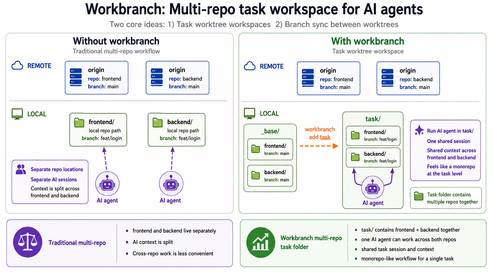
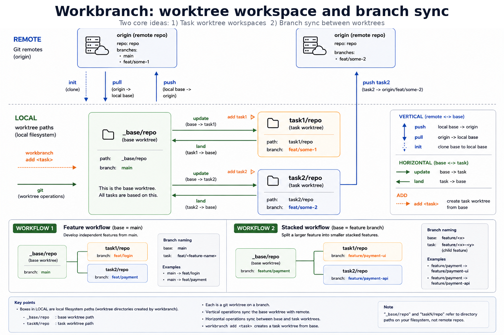

# workbranch

**English** | [한국어](README.ko.md)

Simplify Git worktree workspaces and branch operations.

## TL;DR

* You want to use Git worktrees, but the `git worktree` commands are hard to remember.
* You keep several feature worktrees open, so updating each workspace from the base branch takes too many manual steps.
* Your frontend and backend live in separate repos, which makes it harder to give AI tools one shared task context.

### Workbranch solution

`workbranch` is for developers who like the idea of Git worktrees, but do not want to manage every task workspace, branch sync, and multi-repo context by hand.

* Run `workbranch init` once, then manage task workspaces with `workbranch add` and `workbranch remove`.
* Use `workbranch update` to bring base branch changes into one task workspace or all task workspaces.
* Push a task branch for PR review, or use `workbranch land` when you want to bring feature work back into the local base worktree.
* Put frontend, backend, and other repos under one task directory so AI tools can work from the same context.


`workbranch` has two core features:

1. Task workspaces: create and remove task-oriented Git worktree folders.
2. Branch sync: move changes between the base worktree and task worktrees.

## 1. Task workspaces

`workbranch` organizes linked worktrees by task/feature. A task such as `login` or `payment` gets its own folder, and each configured repo gets a linked worktree inside that folder.

```text
workbranch init              clone main worktrees from .workbranch.config
workbranch config            update base branches and per-repo setup commands
workbranch add <task>        create linked worktrees for a task
workbranch remove <task>     remove task worktrees
```

For a single repo:

`workbranch` still uses `<task>/<repo>`. The extra repo directory keeps the layout consistent with multi-repo projects, but single-repo users usually work from `<task>/<repo>`.

```text
my-app-workspace
├── .workbranch.config
├── _base                   // base worktree
│   └── my-app                 - repo: base
├── login                   // feature worktree              <-- AI agent
│   └── my-app                 - repo: login task
└── payment                 // feature worktree              <-- AI agent
    └── my-app                 - repo: payment task
```



For multi-repo:
In multi-repo work, the feature folder gives one shared workspace/session context for all repos in that task.

```text
my-app-workspace
├── .workbranch.config
├── _base                   // base worktree
│   ├── frontend               - frontend repo: base
│   └── backend                - backend repo: base
├── login                   // feature worktree              <-- AI agent
│   ├── frontend               - frontend repo: login task
│   └── backend                - backend repo: login task
└── payment                 // feature worktree              <-- AI agent
    ├── frontend               - frontend repo: payment task
    └── backend                - backend repo: payment task
```

## 2. Branch sync



`workbranch` syncs Git branches in two directions:

- vertical: remote base branch `<->` local base worktree
- horizontal: local base worktree `<->` feature worktrees

```text
remote:     origin/<base>                          origin/<task2>
                 ^                                      ^
                 | push                                 | push task2
                 |                                      |
                 | pull                                 |
                 v                                      |

local:      _base/<repo>      task1/<repo>      task2/<repo>      task3/<repo>
            base worktree     feature worktree  feature worktree  feature worktree
                 ^                  |                |                |
          land   |<----------------------------------|                |
                 |
                 |----------------->|                |                |
          update |---------------------------------->|                |
                 |--------------------------------------------------->|
```

Common flow:

```text
workbranch init or config
workbranch add <task>
workbranch update <task>      # bring base changes into the task workspace
workbranch push <task>        # push task branches for PR review
workbranch land <task>        # optional: bring task work back into local base
workbranch remove <task>
```

Commands:

```text
vertical
  workbranch pull             origin/<base> -> _base/<repo>
  workbranch push             _base/<repo>  -> origin/<base>

  workbranch push <feature>   feature branch -> origin/<feature-branch>
  workbranch push task1       push every repo task1 branch
  workbranch push task1 --repo frontend
                              push only frontend task1 branch

horizontal
  workbranch update           _base/<repo>  -> every feature worktree
  workbranch update <feature> _base/<repo>  -> one feature worktree
  workbranch land <feature>   feature       -> _base/<repo>
```

#### Safety

Before mutating worktrees, `workbranch` checks for common unsafe states:

- dirty worktrees
- wrong current branch
- rebase in progress
- missing repos or task worktrees
- non-fast-forward pull, push, or land paths

## Per-repo setup

Use `workbranch config` to update each repo's base branch and setup command in one pass:

```bash
workbranch config
workbranch add login
```

At each repo prompt, press Enter to keep the current value or type `--clear` at the setup prompt to remove that repo's setup command. If you change a base branch after repos are cloned, `workbranch config` prints the checkout commands needed for the existing `_base/<repo>` worktree.

Repo setup commands run from `<task>/<repo>` and receive:

```text
WORKBRANCH_PROJECT_ROOT
WORKBRANCH_TASK
WORKBRANCH_TASK_DIR
WORKBRANCH_BASE_DIR
WORKBRANCH_REPOS
WORKBRANCH_REPO
WORKBRANCH_REPO_DIR
WORKBRANCH_BASE_REPO_DIR
```

## Install

### Homebrew

Install the latest versioned release from the Homebrew tap:

```bash
brew install tkhwang/tap/workbranch
```

The formula builds the generated `bin/workbranch` from the tagged source archive before installing it.

### curl installer

Install the latest `main` build directly:

```bash
curl -fsSL https://raw.githubusercontent.com/tkhwang/workbranch/main/install.sh | bash
```

The curl installer tracks `main`, while Homebrew tracks published GitHub Releases.
