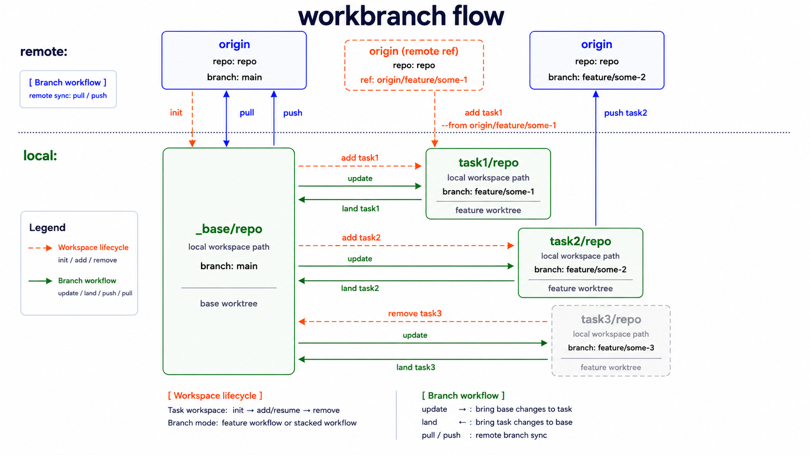

# workbranch

**English** | [한국어](README.ko.md)

Manage Git worktree task spaces without memorizing `git worktree` commands.

`workbranch` creates one task folder per feature, works with one repo or many repos, and keeps branch sync commands short and safe.

Its two core workflows are **Workspace lifecycle** for creating and removing task workspaces, and **Branch workflow** for updating, landing, and pushing task branches.



## Install

### Homebrew

```bash
brew install tkhwang/tap/workbranch
```

If you prefer to add the tap first:

```bash
brew tap tkhwang/tap
brew install workbranch
```

### curl installer

```bash
curl -fsSL https://raw.githubusercontent.com/tkhwang/workbranch/main/install.sh | bash
```

Homebrew installs published releases. The curl installer tracks `main`.

## Quick start

```bash
workbranch init
workbranch add login
cd login/<repo>
# work on the task
workbranch update login
workbranch push login
workbranch remove login
```

`workbranch add <task>` uses `<task>` as the folder name, shows each repo's base branch, then prompts for that repo's task branch. Press Enter to accept the suggested default branch name. Defaults are `feature/<task>` from main-style base branches and `<base-branch>-<task>` from `feature/*`, `feat/*`, or the configured legacy prefix.

Plain `workbranch add <task>` creates task branches from the current HEAD of your local `_base/<repo>` worktrees. It does not pull remote base branches automatically. To start from the latest remote base, run:

```bash
workbranch pull
workbranch add <task>
```

Use `workbranch add <task> --from <ref>` to seed the new task branches from another source ref. For example, `workbranch add task1 --from feat/XXX` fetches origin, prefers `origin/feat/XXX` when it exists, and creates the linked task worktrees from that ref while still using the prompted task branch names. Later `workbranch status` still compares the task branch to the current local base; the source ref is creation context, not a persistent status baseline.

Use `workbranch config` when you want to update project settings, base branches, IDE/terminal launch commands, or per-repo setup commands without cloning repos again.

## What it creates

For every task, `workbranch` creates linked worktrees under one shared task directory:

```text
my-app-workspace
├── .workbranch.config
├── _base
│   ├── frontend
│   └── backend
└── login
    ├── frontend
    └── backend
```

Single-repo projects use the same shape with one repo directory inside each task.

## Platform support

Core workbranch commands are supported on macOS, Linux, and WSL. Tool app launchers are macOS-only because the built-in app presets use macOS `open` and macOS app names.

Supported everywhere: Git/worktree commands, `path`, `list`, `status`, `config`, `init`, and generated CLI distribution checks.

macOS-only: `finder`, `ide`, `terminal`, `config ide`, and `config terminal`. On Linux/WSL, full `workbranch config` and `workbranch init` stay available and skip tool app prompts.

## Common commands

### Workspace lifecycle

| Command | Use it to |
| --- | --- |
| `workbranch init` | Create or clone base worktrees from config |
| `workbranch config` | Edit project settings, base branches, tool commands, and repo setup commands |
| `workbranch config ide` | Update only the configured IDE command |
| `workbranch config terminal` | Update only the configured terminal command |
| `workbranch add <task> [--from <ref>]` | Create a task workspace |
| `workbranch list` | Show repos and task workspaces |
| `workbranch remove <task>` | Remove task worktrees and local task branches |

### Branch workflow

| Command | Use it to |
| --- | --- |
| `workbranch status` | Show base remote diff, task diff, and dirty state |
| `workbranch pull` | Pull remote base branches into `_base/<repo>` |
| `workbranch update [task]` | Merge local base changes into task worktrees |
| `workbranch push` | Push base branches |
| `workbranch push <task>` | Push task branches |
| `workbranch land <task>` | Fast-forward task work back into local base branches |

### Tool commands

| Command | Use it to |
| --- | --- |
| `workbranch path <task>` | Print a task workspace or repo path |
| `workbranch finder <task>` | Open the task workspace folder in Finder |
| `workbranch ide <task>` | Open task repo worktrees in the configured IDE |
| `workbranch terminal <task>` | Open task repo worktrees in the configured terminal |

### Other

| Command | Use it to |
| --- | --- |
| `workbranch -v` | Show the installed version |

Add `--repo <repo>` to supported Branch workflow and Tool commands when you want to operate on one repo only.

## CLI display

In an interactive terminal, `workbranch` uses color, a compact banner on help/init screens, and section titles to make command output easier to scan. Captured or piped output stays plain by default so scripts and tests do not receive ANSI escape sequences.

Color controls:

```bash
NO_COLOR=1 workbranch help              # always plain
WORKBRANCH_COLOR=never workbranch help  # always plain
WORKBRANCH_COLOR=always workbranch help # force enhanced display
```

`workbranch path <task>` and `workbranch path <task> --repo <repo>` remain plain path-only outputs for scripting.

## Opening task workspaces

Configure one IDE and one terminal command for the project:

```bash
workbranch config ide
workbranch config terminal
```

Then open every repo in a task workspace:

```bash
workbranch finder login
workbranch ide login
workbranch terminal login
```

Built-in macOS IDE presets open each repo path in a separate IDE window for VS Code-like apps. The config directive is `IDE <command>`; preset order is Cursor, Antigravity, Windsurf, Zed, Sublime Text, Xcode, then VS Code. Existing `IDE open -a Cursor`, `IDE open -a "Antigravity IDE"`, `IDE open -a "Visual Studio Code"`, or `IDE open -a Windsurf` command shapes are launched as `open -na ... --args --new-window` for the same behavior. Zed remains `open -na Zed` until its CLI contract is verified.

Limit to one repo when needed:

```bash
workbranch ide login --repo frontend
workbranch terminal login --repo backend
```

Print full paths for scripting:

```bash
workbranch path login
workbranch path login --repo frontend
```

Launcher commands run repo-by-repo. Commands that keep running in the foreground, such as a raw TUI terminal command, should use `--repo` or a custom non-blocking wrapper.

## Setup commands

`workbranch config` can store a setup command per repo. When you run `workbranch add <task>`, each setup command runs inside `<task>/<repo>`.

See the [MVP spec](docs/specs/0001-workbranch-mvp.md) for the config format and setup environment variables.

## Safety

Before changing worktrees, `workbranch` checks for dirty worktrees, wrong branches, rebase state, missing repos, and non-fast-forward Git paths.

## More docs

- [Architecture](docs/architecture.md)
- [Git operations](docs/git-operations.md)
- [MVP spec](docs/specs/0001-workbranch-mvp.md)
