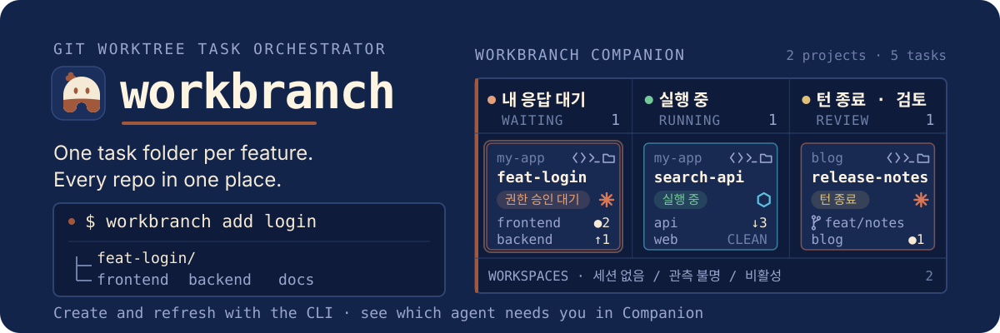
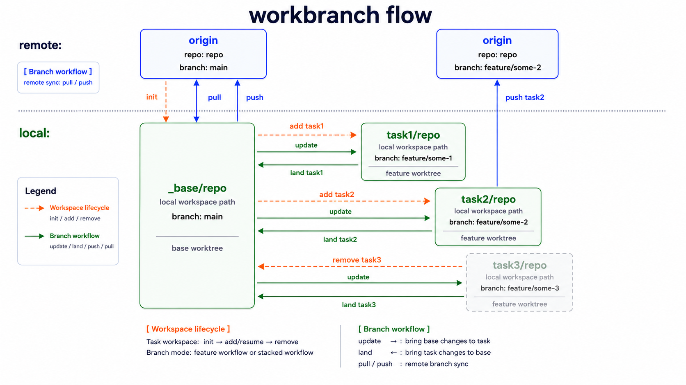

# workbranch

<p align="center">
  
</p>

**English** | [한국어](README.ko.md)

[](https://github.com/tkhwang/workbranch/actions/workflows/ci.yml)
[](https://github.com/tkhwang/workbranch/releases)
[](LICENSE)


Manage Git worktree task spaces without memorizing `git worktree` commands.

`workbranch` creates one task folder per feature, works with one repo or many repos, and keeps branch refresh commands short and safe.

The CLI reads shared workbranch project state and runs the task worktree/Git flow. Companion shows each task's AI agent sessions on a `내 응답 대기 | 실행 중 | 턴 종료 · 검토` (waiting on you | running | turn ended, review) board in the macOS menu bar, so you can see which agent needs your reply. A usage summary above the board and the Usage view show Claude Code and Codex token usage and plan limits, read from the agents' own local files.


## At a glance

| When you need to | Use | Role | Install |
| ---------------- | --- | ---- | ------- |
| Create, refresh, land, or push task workspaces | `workbranch` CLI | Runs the actual Git/worktree workflow | `brew install tkhwang/tap/workbranch` |
| See which agent sessions wait on you, run, or need review; open tasks in your IDE; check repository state | Workbranch Companion | Shows hook observations and Git facts from the menu bar | `brew install --cask tkhwang/tap/workbranch-companion` |

## Quick start

```bash
brew install tkhwang/tap/workbranch
workbranch init                 # register a project and repos; can create the first task
workbranch add login            # create another task whenever you need one
cd feat-login                   # task root: run your AI agent here
workbranch status               # check every repo in the task
```

On macOS, install Companion too:

```bash
brew install --cask tkhwang/tap/workbranch-companion
```

## Install

### Homebrew

```bash
brew install tkhwang/tap/workbranch
```

If you prefer to add the tap first:

```bash
brew tap tkhwang/tap
brew install workbranch
```

### curl installer

```bash
curl -fsSL https://raw.githubusercontent.com/tkhwang/workbranch/main/install.sh | bash
```

Homebrew installs published releases. The curl installer tracks `main`.

## Create your first project

`workbranch init` walks you through setup and can create your first task on the spot.

```bash
workbranch init
# Project name, then register one repo (name + Git URL + base branch)
# "Add another repo?"    -> N       # one repo is enough to start
# "Add your first task?" -> login   # creates the feat-login workspace
```

Need another task later? Create one anytime with `workbranch add`.

```bash
workbranch add login # (branch) feat/login
                     # (folder) feat-login/<repo>
```

These quick-start examples assume a `main`/`master` base. If every repo is based on the same parent feature branch, such as `feature/cpq`, `workbranch add login` asks only for the task name and creates folder `feature-cpq-login/<repo>` with branch `feature/cpq-login`.

## What the CLI creates

For every task, the CLI creates linked worktrees under one shared task directory:

```text
my-app-workspace
├── .workbranch.config
├── _base
│   ├── frontend
│   └── backend
└── feat-login          // task root: not git-managed; run your AI agent here
    ├── frontend        // Git repo worktree
    └── backend         // Git repo worktree
```

For multi-repo products, `workbranch` gathers every repo an agent needs into one task folder. That makes AI-agent sessions easier to start, inspect, and clean up than juggling separate clones or unrelated worktrees.

Before an agent starts, `workbranch refresh <task>` brings every repo in the task up to the latest base in one command — no per-repo pulling or rebasing.

See [AI agent workflows](docs/ai-agents.md) for the multi-repo benefits.

Companion reads this structure through `workbranch list --global --json`. Below the runtime board, the Main view's collapsible `Base repositories` section shows each base repo's branch, dirty state, and ahead/behind counts against cached `origin/<baseBranch>` refs. PULL/PUSH/CHECK pills are guidance only; dirty + behind advises CHECK first, and an unreadable repo shows UNAVAILABLE without hiding healthy data. Reads do not fetch. Task creation, refresh, land, and push remain CLI actions.

## Working on a task

Now work inside the task workspace. The task root (`<task>`) is a non-git workbranch metadata/agent workspace; the actual Git repos live under `<task>/<repo>`. Before editing a repo, read and follow repo-local agent instructions such as `<task>/<repo>/AGENTS.md`, `<task>/<repo>/CLAUDE.md`, or `<task>/<repo>/.claude/` when present.

```bash
# macOS: open code repos in the IDE, and the task root in the terminal
workbranch ide feat-login        # opens feat-login/<repo> worktrees
workbranch terminal feat-login   # opens feat-login task root

# or anywhere
cd feat-login/<repo>
# edit code and run git commands in the repo
```

Need the latest base while you work? See [Staying up to date](#staying-up-to-date). When the work is done, [ship it](#two-ways-to-ship).

## Staying up to date

To bring a single task up to the latest base, `pull` the base from its remote and `update <task>` to apply it to the task.

```bash
workbranch pull               # pull every base from its remote
workbranch update feat-login  # apply local base updates to every repo in the task

# combined: pull + update in one step
workbranch refresh feat-login
```

Working in several tasks at once? Run them without a task name to refresh every task in one go.

```bash
workbranch pull      # update local bases
workbranch update    # apply local bases to every task

# combined
workbranch refresh   # pull bases, then update every task
```

`update` and `refresh` stop when a task worktree is dirty. Set the changes aside with `workbranch stash`, which saves them under the current branch instead of the `git stash` list that every worktree shares:

```bash
workbranch stash              # run inside <task>/<repo>
workbranch refresh feat-login
workbranch stash pop          # restores only this branch's changes
```

To refresh the base, apply it to a task, and land in one step, use `finalize`.

```bash
workbranch finalize feat-login   # base pull → feat-login update → land
```

## Two ways to ship

What `push` publishes depends on your base branch.

|                      | Feature flow                    | Stacked flow                                            |
| -------------------- | ------------------------------- | ------------------------------------------------------- |
| Base branch          | `main` / `master`               | a feature branch, e.g. `feat/login`                     |
| Task branch (folder) | `feat/login` (`feat-login`)     | `feat/login-part1` (`feat-login-part1`)                 |
| Ship                 | push the task branch, open a PR | land into base, then push the base                      |
| Command              | `workbranch push feat-login`    | `workbranch land feat-login-part1`<br>`workbranch push` |
| Pushes               | task branch                     | base branch                                             |

### Feature flow

```bash
# edit code in feat-login/<repo>

workbranch push feat-login # local feat/login -> origin/feat/login
```

### Stacked flow

```bash
# edit code in feat-login-part1/<repo>

workbranch land feat-login-part1 # fast-forward feat/login-part1 into local base (feat/login)
workbranch push                  # local feat/login -> origin/feat/login
```

## Commands

| Command                     | Use it to                                                               |
| --------------------------- | ----------------------------------------------------------------------- |
| `workbranch init`           | Create or clone base worktrees from config                              |
| `workbranch add [<task>]`   | Create a task workspace                                                 |
| `workbranch list [--json]`  | Show repos and task workspaces; `--json` is machine-readable output     |
| `workbranch noti ...`       | Add, list, or clear task notifications                                  |
| `workbranch status`         | Show base remote diff, task diff, and dirty state                       |
| `workbranch update [task]`  | Update every repo in the task from local base (no pull)                 |
| `workbranch land <task>`    | Fast-forward task work into local base branches                         |
| `workbranch push [task]`    | Push base or task branches                                              |
| `workbranch doctor [--fix]` | Diagnose project health; safe fixes include stale worktree pruning and brief H1 repair |

Combined flow shortcuts:

| Command                      | Use it to                                           |
| ---------------------------- | --------------------------------------------------- |
| `workbranch refresh [task]`  | Pull base branches, then update task workspaces     |
| `workbranch finalize <task>` | Pull base branches, update one task, then land it   |
| `workbranch prune`           | Remove clean task workspaces already merged into local base branches |



## View with Companion

Workbranch Companion is a macOS menu bar app with Main, Usage, and Settings views.

- Main: a kanban board of agent runtime state. `내 응답 대기` (waiting on you) means the agent needs your permission, answer, plan approval, or input; `실행 중` (running) means it is working; `턴 종료 · 검토` (turn ended, review) means its turn ended and it is your turn to review, not that the task is done. A task appears once, in its lead session's column. Tasks with no session, an unknown (stale) observation, or only inactive sessions are listed under `WORKSPACES` below the board. A usage summary above the board shows Claude Code and Codex side by side: plan limits (Claude 5h and weekly, Codex weekly) with time to reset and today's tokens, then the last seven days by day with both agents' totals
- Task cards: IDE/Terminal/Finder launchers and each repo's branch and Git facts (`●N` dirty files, `↑N` ahead, `↓N` behind, or `CLEAN`) are visible without expanding, next to the latest request, state, provider icon (Claude Code, Codex, or Grok Build), and observation age. Click a card for last commits and session details; double-click opens the task in your IDE. Each repo row keeps a note
- Usage: per-agent detail — limits, today's input/output/cache tokens, a shared 14-day daily chart, and a last-7-days table. Companion reads only local files and never signs in: Claude Code transcripts in `~/.claude/projects` and its cached `/usage` result in `~/.claude.json`, and Codex rollouts in `~/.codex/sessions`. Limits are the agents' last observation, so each shows its age and dims when stale; Claude's limits refresh when Claude Code refreshes `/usage`, or live while a Claude Code session is open once Settings > Claude Limits > Live Claude Limits is on (opt-in: it points `statusLine` in `~/.claude/settings.json` at a relay that saves the status line's `rate_limits` and still runs your previous status line; turning it off restores it)
- Settings: controls launch at login, the text beside the menu bar icon (pick any of Claude 5h, Claude weekly, Codex weekly and today's tokens, shown as used or remaining percent, for example `CL 42·63  CO 18 · 31.0M`; refreshed every minute, `–` when a reading is stale), the interface font and text size, the Claude Code or Codex theme, and CLI/agent connections
- Updates: the header's update button opens an update panel. It checks Homebrew only when you ask, and one update action upgrades the CLI before Companion. Setup and update buttons show a spinner while they run, and each result appears next to the button that ran it

Companion reads hook-driven runtime snapshots separately from Git status. No `TASK-WORKBRANCH.md` reporting is required. Install hooks with `workbranch hooks install --provider claude` or `--provider codex`, then review provider hook trust. Grok Build needs explicit trust: inspect the plugin source with `workbranch hooks describe --provider grok`, and only if you trust it run `workbranch hooks install --provider grok --trust`. Companion's Grok connect button shows the same source first. See [Companion installation and agent connections](docs/usage.md#companion-installation-and-agent-connections).

Install:

```bash
brew install --cask tkhwang/tap/workbranch-companion
```

## More docs

- [Task identity and branch names](docs/task-identity.md)
- [Usage details](docs/usage.md)
- [AI agent workflows](docs/ai-agents.md)
- [Architecture](docs/architecture.md)
- [Git operations](docs/git-operations.md)
- [MVP spec](docs/specs/0001-workbranch-mvp.md)

Use Companion onboarding or Settings to install the CLI with Homebrew and connect Claude, Codex or Grok.
